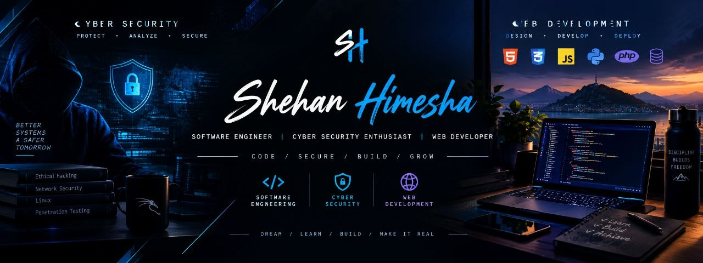

  

# 👋 Hi, I'm Shehan Himesha

### 💻 Software Engineering Student | 🔐 Cyber Security Enthusiast | 🌐 Web Developer

I'm passionate about software development, cybersecurity, and building practical projects.

Currently, I'm improving my skills in programming, web development, Git & GitHub, and cybersecurity.

---

## 🚀 About Me

- 🎓 Software Engineering Student
- 🔐 Currently learning Cyber Security
- 💻 Interested in Software Development
- 🌐 Building Web Projects
- 📚 Always learning and improving
- 🛠️ Currently improving my Git & GitHub skills

---

## 🧠 Skills & Technologies

### Programming Languages

### Web Development

### Tools

---

## 🔐 Cyber Security

Currently learning:

- 🌐 Networking Fundamentals
- 🐧 Linux
- 🔒 Cyber Security Fundamentals
- 🛡️ Network Security
- 🔍 Ethical Hacking
- 🧪 Security Labs & Practical Exercises

---

📊 GitHub Activity

  

[9/28/2026 11:53 AM] Shehan Himesha: 

  
  

[9/28/2026 11:54 AM] Shehan Himesha: 

  
  

## 📌 Current Projects

- 🌐 Personal Portfolio Website
- 💻 Web Development Projects
- 🔐 Cyber Security Learning Projects
- 🔧 Git & GitHub Practice

---

## 🎯 My Goal

> Learn → Build → Secure → Improve

My goal is to become a skilled Software Engineer with strong Cyber Security knowledge.

---

## 🌱 Currently Learning

Software Engineering • Cyber Security • Git & GitHub • Web Development

---

### ⭐️ Thanks for visiting my profile!

Keep Learning. Keep Building. Keep Growing. 🚀
